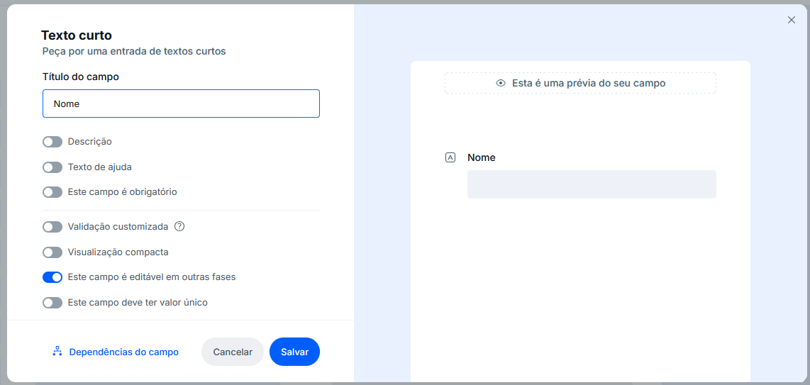
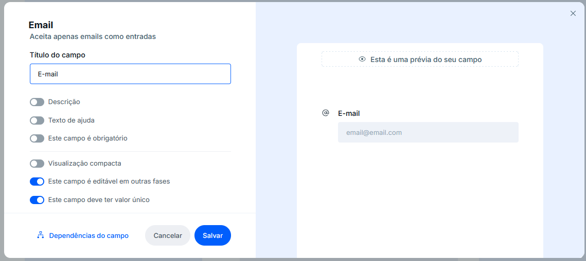
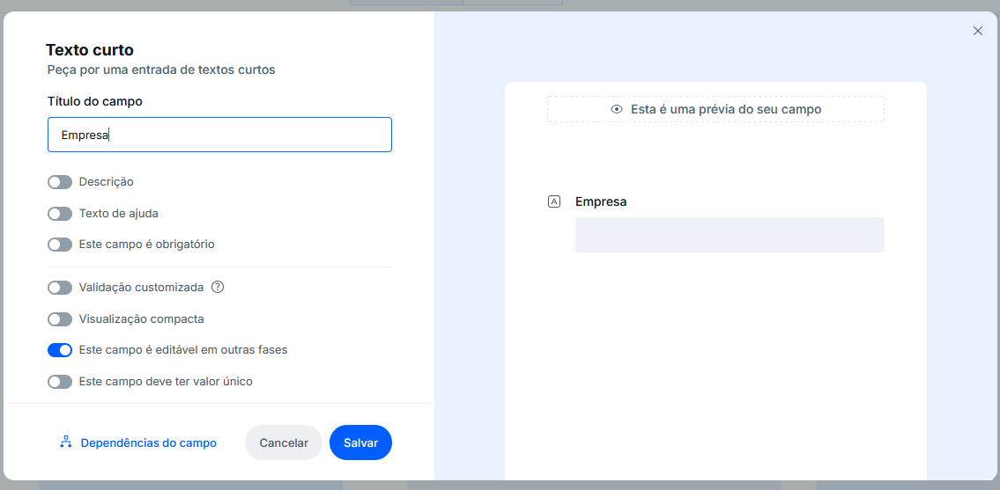
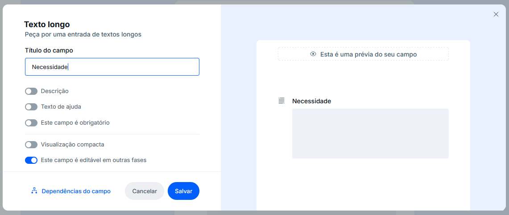
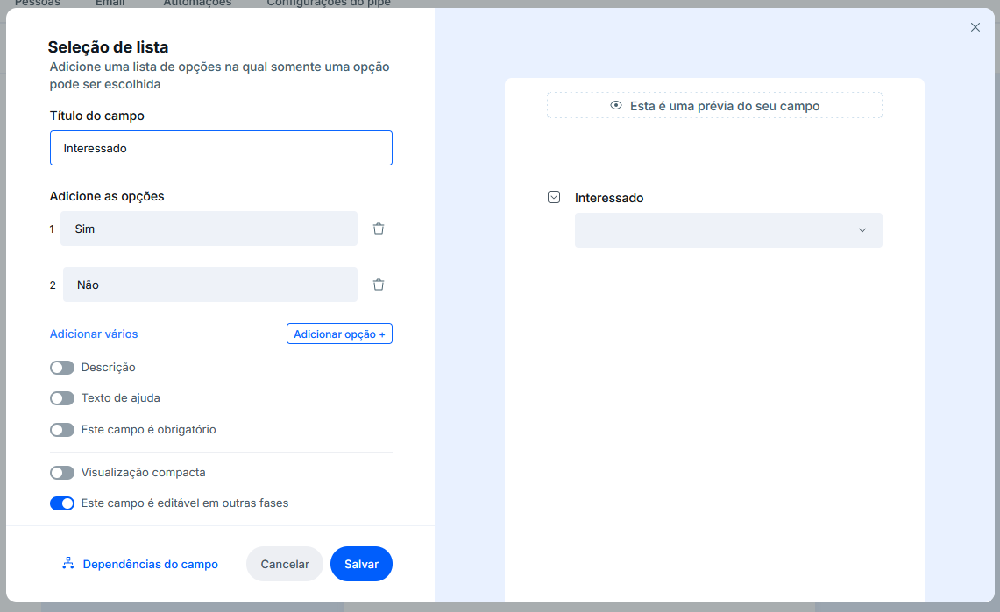
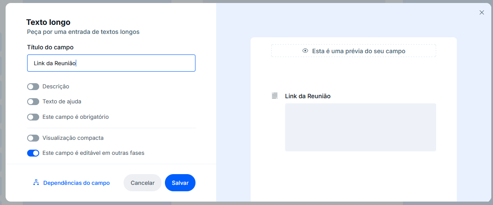
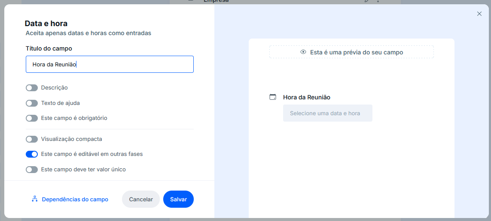
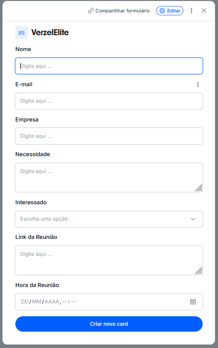
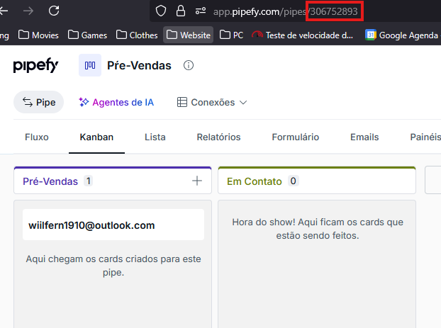
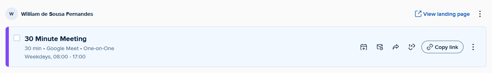

# 🤖 Chatbot de Qualificação de Leads

Este projeto é um assistente de vendas (SDR) virtual construído com Spring Boot. Ele utiliza a API da OpenAI para interagir com potenciais clientes, qualificá-los e, se houver interesse, oferecer horários para uma reunião via Calendly. Todas as interações e dados dos leads são sincronizados com um funil de vendas no Pipefy.

## ✨ Tecnologias Utilizadas

- **Backend**: Java 17, Spring Boot 3
- **Comunicação**: WebSockets (com STOMP)
- **Banco de Dados**: PostgreSQL
- **IA**: OpenAI (GPT-4o-mini)
- **Agendamento**: Calendly API
- **CRM/Funil**: Pipefy API
- **Build**: Maven

## ⚙️ Setup do Projeto

Siga os passos abaixo para configurar e executar o projeto em seu ambiente local.

### 1. Pré-requisitos

Antes de começar, garanta que você tenha:
- ✅ Java 17 (ou superior) instalado.
- ✅ Maven instalado.
- ✅ Conta no Pipefy, Calendly, OpenAI e Neon (ou outro provedor de PostgreSQL).
- ✅ Ngrok instalado para expor sua aplicação localmente.

### 2. Variáveis de Ambiente

O backend precisa de algumas chaves de API e URLs para funcionar. Você pode configurá-las como variáveis de ambiente no seu sistema ou diretamente na sua IDE.

| Variável            | Descrição                                                              | Exemplo                                                              |
|---------------------|------------------------------------------------------------------------|----------------------------------------------------------------------|
| `FRONTEND_URL`      | URL do frontend para permitir CORS.                                    | `http://localhost:5173`                                              |
| `DB_URL`            | Connection string do seu banco de dados PostgreSQL.                    | `jdbc:postgresql://...`                                              |
| `PIPEFY_TOKEN`      | Token de API pessoal do Pipefy.                                        | `eyJhbGciOi...`                                                      |
| `PIPEFY_PIPE_ID`    | ID do seu pipe de "Pré-Vendas" no Pipefy.                              | `306752893`                                                          |
| `CALENDLY_TOKEN`    | Token de API pessoal do Calendly.                                      | `eyJraWQiOi...`                                                      |
| `CALENDLY_CALLBACK` | URL de webhook (via Ngrok) para receber eventos do Calendly.           | `https://seu-dominio.ngrok-free.dev/calendly/webhook`                |
| `OPENAI_TOKEN`      | Chave de API da OpenAI.                                                | `sk-proj-...`                                                        |

### 3. Configuração dos Serviços Externos

#### 📦 Pipefy

1.  Crie um novo Pipe com o nome **"Pré-Vendas"**.
2.  Dentro do pipe, crie uma fase chamada **"Pré-Vendas"**.
3.  Clique em **"+ Criar novo card"** e adicione os seguintes campos, **respeitando exatamente os nomes e tipos**:

    - **Nome**: `Texto curto`
    

    - **E-mail**: `E-mail`
    

    - **Empresa**: `Texto curto`
    

    - **Necessidade**: `Texto longo`
    

    - **Interessado**: `Seleção de lista` com as opções "Sim" e "Não".
    
    - **Link da Reunião**: `Texto Longo`
    
    - **Hora da Reunião**: `Data e Hora`
    

4.  Vá em **"Configurações do Pipe"** e defina o campo **"E-mail"** como o título do card, o seu Card ao final deve ficar parecido com isso:
    

5.  Obtenha seu **Token de API** em https://app.pipefy.com/tokens.
6.  O **PIPEFY_PIPE_ID** pode ser encontrado na URL do seu pipe.
    

#### 📅 Calendly

1.  Crie uma conta e conecte-a ao seu Google Calendar.
2.  Configure seus horários de disponibilidade (ex: 8:00 às 17:00).
    
3.  Vá para **"Integrations & Apps"** > **"API & Webhooks"** para gerar seu **CALENDLY_TOKEN**.
4.  Para o `CALENDLY_CALLBACK`, você precisará instalar o Ngrok https://ngrok.com/download/windows:
    - Autentique-se no Ngrok (só precisa fazer uma vez):
      ```sh
      ngrok config add-authtoken SEU_AUTH_TOKEN_AQUI
      ```
    - Inicie o Ngrok para expor a porta da sua aplicação (padrão: 3000):
      ```sh
      ngrok http 3000
      ```
    - O Ngrok fornecerá uma URL pública (ex: `https://xxxx.ngrok-free.dev`). Use essa URL para montar seu `CALENDLY_CALLBACK`, adicionando o endpoint do webhook: `https://xxxx.ngrok-free.dev/calendly/webhook`.

#### 🐘 PostgreSQL (Neon)

1.  Crie uma conta gratuita no Neon https://neon.com/.
2.  Crie um novo projeto.
3.  Na dashboard do projeto, vá para a seção **"Connection Details"**.
4.  Copie a **Connection String** no formato Java e use-a para a variável `DB_URL`.

#### 🧠 OpenAI

1.  Crie uma conta na OpenAI.
2.  Vá para a seção **"API Keys"** e crie uma nova chave secreta.

### 4. Como Rodar a Aplicação

Após configurar todas as variáveis de ambiente, você pode iniciar o backend:

```bash
# Navegue até a pasta do backend
cd Backend

# Execute a aplicação com o Maven
./mvnw spring-boot:run
```

A aplicação estará rodando em `http://localhost:3000`.

## ⚛️ Frontend (React + Vite)

Esta seção descreve como configurar e executar o frontend da aplicação.

### 1. Pré-requisitos

- ✅ Node.js (versão 18 ou superior) instalado.

### 2. Setup

1.  **Navegue até a pasta raiz** do projeto e crie a aplicação React usando o Vite:
    ```bash
    # Este comando cria uma nova pasta 'Frontend' com um projeto React + TypeScript
    npm create vite@latest Frontend -- --template react-ts
    ```

2.  **Acesse a pasta do frontend** e instale as dependências:
    ```bash
    cd Frontend
    npm install
    ```

3.  **Instale as bibliotecas para WebSocket**:
    Para se comunicar com o backend em tempo real, vamos usar STOMP sobre SockJS.
    ```bash
    npm install @stomp/stompjs sockjs-client
    ```

4.  **Inicie a aplicação frontend**:
    ```bash
    npm run dev
    ```
    A aplicação estará disponível em `http://localhost:5173`. O backend já está configurado para aceitar requisições desta origem.
